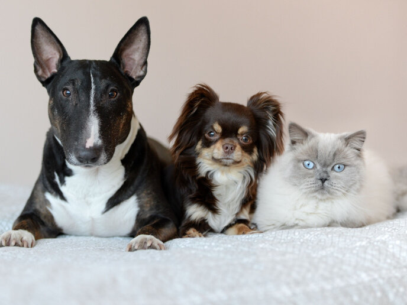

# Dog Cat Detection with YOLOv5

Simple project that applied YOLOv5 in detection of dogs and cats

## Environment and Dependencies
- Python 3.10.6

Install requirements
```bash
pip install -r requirements.txt
```

## Data
- Data used for this project can be found [here.](https://www.kaggle.com/datasets/andrewmvd/dog-and-cat-detection)
- Dataset creation: Refer to [YOLOv5 Train Custom Data](https://github.com/ultralytics/yolov5/wiki/Train-Custom-Data) for more information. In short, labels and bouding boxes were converted in to .txt format as follow: 
    `class x_center y_center width height`
- Data config for training: Standard YOLOv5 YAML format. Refer to [`dataset.yaml`](dataset.yaml) for details.
```yaml
path: ../data/  # dataset root dir
train: train/images  # train images (relative to 'path') 80% images
val: valid/images  # val images (relative to 'path') 20% images
test:  # test images (optional)

# Classes (2 classes)
names:
  0: cat
  1: dog
``` 
## Training
Model was trained with 10 epochs and standard COCO128 configuration (batch-size, image size, pretrained `--weights yolov5s.pt`)
```bash
python train.py --img 640 --batch 16 --epochs 10 --data ../dataset.yaml --weights yolov5s.pt --device 0
```
Training results on valid set: 

Metrics:


## Inference with `detect.py`
`detect.py` runs inference on a variety of sources.
```bash
python detect.py --weights [path-to-model] --source [path-to-file] 
```

| Input Image | Result Image |
| --- | --- |
|  |  |

## Reference 
- [YOLOv5](https://github.com/ultralytics/yolov5)